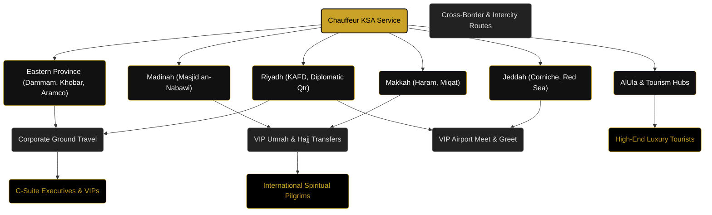

# Luxury Chauffeur Service KSA: 2026 Topical Map & 100 Semantic Blog Titles
*Optimized for Semantic SEO, Natural Language Processing (NLP), Geo-targeting, Answer Engine Optimization (AEO), and LLM Knowledge Graphs.*

---

## 🗺️ The 2026 Search & AI Landscape (AEO & Semantic SEO)

In **2026**, search engines are no longer just looking for matching keywords. AI Search Engines (Google AI Overviews/SGE, ChatGPT Search, Gemini, Perplexity) analyze search queries through **NLP (Natural Language Processing)** and map relationships between **Entities** (e.g., *Riyadh*, *Umrah*, *Mercedes S-Class*, *Chauffeur Service KSA*, *KAFD*). 

To rank at the top of AI search answers, your blog must build a highly authoritative **Topical Cluster Network**. By publishing these 100 highly targeted articles, you establish **Topical Authority**, signaling to search engines and LLM web crawlers that your website is the definitive, trusted source for premium ground transport and luxury travel logistics in Saudi Arabia.

### 🧬 Core Entity Relationship Map
Below is the conceptual layout of how AI Search and LLM Knowledge Graphs link your business to search intent in KSA:

---

## 🗂️ The 100 Blog Titles: Organized by Topical Clusters

To maintain perfect structural integrity with your website, these 100 titles are mathematically distributed across your website's **6 active categories**:

1. **Pilgrimage Travel Guides** (18 Titles)
2. **City Travel Guides** (17 Titles)
3. **Intercity Route Guides** (17 Titles)
4. **VIP Airport Transfers** (16 Titles)
5. **Professional Driver Services** (16 Titles)
6. **Chauffeur Service Benefits** (16 Titles)

---

### 🕌 Cluster 1: Pilgrimage Travel Guides (18 Titles)
*Focus: Seamless spiritual journeys, Umrah logistics, family VIP packages, Haram proximity drops, and Ziyarat tours.*

| # | 2026 AEO-Optimized Blog Title | Primary NLP Keywords | Geo-Entities Targeted | Search Intent / AI Query |
|---|---|---|---|---|
| 1 | **What is the Best Private Driver Option for Elderly Pilgrims Performing Umrah?** | elderly Umrah transport, private driver, wheelchair accessible SUV | Makkah, Jeddah Airport | AEO Voice Search / Informational |
| 2 | **A Complete Guide to Luxury Ziyarat Tours in Madinah: Historic Sites in Comfort** | Madinah Ziyarat tour, Quba Mosque, Mount Uhud, premium SUV | Madinah, Prince Mohammad Airport | Informational / Local Guide |
| 3 | **How to Plan a VIP Umrah: Elite Ground Transport and Haram Proximity Logistics** | VIP Umrah packages, luxury ground transport, Makkah clock tower | Makkah, Jeddah | Commercial / High-Value |
| 4 | **Umrah with Family: Why Booking a Private GMC Yukon XL Solves Travel Stress** | family Umrah travel, GMC Yukon XL, spacious pilgrim transport | Makkah, Madinah | Informational / Transactional |
| 5 | **How to Navigate the Makkah Haram Boundaries: Chauffeur Drop-off Points Explained** | Haram boundaries, Makkah chauffeur drop-off, Masjid al-Haram access | Makkah | AEO Snippet / Informational |
| 6 | **Madinah to Makkah Pilgrim Transport: Mercedes V-Class vs. Haramain High-Speed Train** | Mercedes V-Class transfer, Makkah to Madinah transport, private vs train | Makkah, Madinah | Comparative / Decision-making |
| 7 | **What Are the Miqat Points for Umrah Pilgrims Arriving via Jeddah (JED) Airport?** | Miqat points, Jihfah, Qarn al-Manazil, Umrah pilgrimage entry | JED Airport, Jeddah, Makkah | Voice Search / AEO |
| 8 | **Exclusive Ziyarat Tours in Makkah: Visiting Cave Hira and Jabal al-Nour in Style** | Makkah Ziyarat, Cave Hira, Jabal al-Nour, luxury private car | Makkah, Jabal al-Nour | Informational / Experiential |
| 9 | **Top 5 Luxury Hotels in Makkah with Dedicated Private Driver Pick-up Services** | Makkah luxury hotels, Raffles Makkah, Fairmont Makkah, private driver | Makkah | Commercial / Intent-driven |
| 10| **Visiting Al-Masjid an-Nabawi: A VIP Guide to Madinah’s Sacred Gateways** | Al-Masjid an-Nabawi, VIP Madinah guide, luxury pilgrim travel | Madinah | Informational / Guide |
| 11| **How to Seamlessly Book an Umrah Chauffeur for the Holy Month of Ramadan** | Ramadan Umrah chauffeur, peak season transport, Makkah private driver | Makkah, Madinah | Transactional / Timely |
| 12| **Pilgrim Ground Logistics: Ensuring Smooth Transfers for Non-Arabic Speaking Guests** | English-speaking chauffeurs, pilgrim logistics, multi-lingual drivers | Makkah, Jeddah, Madinah | Problem-solving / Safety |
| 13| **Navigating Makkah During Hajj and Umrah Peak Seasons: Chauffeur Survival Guide** | peak season Makkah, Hajj transport, traffic congestion routes | Makkah | Informational / High-utility |
| 14| **The Spiritual Traveler’s Guide to Historic Mosques in Madinah Outside the Haram** | Masjid Quba, Masjid Qiblatayn, Madinah historical mosques | Madinah | Informational / Cultural |
| 15| **What is the Cost of a Premium Private SUV Service for 7 Days of Umrah?** | private SUV cost, Umrah chauffeur price, Mercedes V-Class rate | Makkah, Madinah, Jeddah | Commercial / AEO Direct Answer |
| 16| **Umrah for VIP State Guests: Customizing High-Security Chauffeur Convoy Logistics** | VIP state guests, high-security chauffeur, executive transport KSA | Makkah, Jeddah, Riyadh | High-end B2B / Security |
| 17| **The Complete Guide to Miqat Stops and Ihram Prep on a Chauffeured Journey** | Miqat stops, Ihram preparation, chauffeured intercity transfer | Jeddah, Makkah, Madinah | Informational / Ritual |
| 18| **How to Avoid Flight-Delay Stress When Commuting to Makkah via Private Chauffeur** | flight delay tracking, JED airport transfer, Makkah road trip | Makkah, JED Airport | AEO Voice Search / Utility |

---

### 🌆 Cluster 2: City Travel Guides (17 Titles)
*Focus: High-end lifestyle, business hubs, cultural heritage spots, top luxury venues, and executive navigation inside cities.*

| # | 2026 AEO-Optimized Blog Title | Primary NLP Keywords | Geo-Entities Targeted | Search Intent / AI Query |
|---|---|---|---|---|
| 19| **The Ultimate Guide to Riyadh's King Abdullah Financial District (KAFD) in Luxury** | King Abdullah Financial District, KAFD transport, Riyadh corporate travel | Riyadh, KAFD | Business Informational |
| 20| **Exploring AlUla’s Hegra: How to Tour Saudi’s UNESCO Gem in a Premium SUV** | Hegra tour, AlUla luxury travel, premium SUV hire AlUla | AlUla, Madinah | Tourism / Luxury |
| 21| **Jeddah Waterfront Guide: Elite Dining, Luxury Yachts, and Chauffeur Routes** | Jeddah Corniche, luxury dining Jeddah, Red Sea waterfront | Jeddah | Lifestyle / Tourism |
| 22| **Diriyah Luxury Travel Guide: Exploring the Birthplace of the Kingdom in Style** | Diriyah, At-Turaif UNESCO, luxury travel Riyadh, private driver | Diriyah, Riyadh | Cultural / Tourism |
| 23| **What Are the Best Fine Dining Restaurants in Riyadh’s Via Riyadh District?** | Via Riyadh restaurants, fine dining Riyadh, luxury transfer Riyadh | Riyadh, Via Riyadh | High-Net-Worth Lifestyle |
| 24| **The Executive Guide to Riyadh's Diplomatic Quarter (DQ): Security and Logistics** | Diplomatic Quarter, DQ security, executive chauffeur Riyadh | Riyadh, DQ | Corporate / Government |
| 25| **Jeddah Al-Balad UNESCO Heritage: Exploring Historic Alleyways with a Private Driver** | Al-Balad Jeddah, historic Jeddah tour, private driver service | Jeddah, Al-Balad | Cultural / Tourism |
| 26| **Corporate Traveler’s Hub: The Best Luxury Business Hotels in Riyadh for 2026** | luxury business hotels, Four Seasons Riyadh, Ritz Carlton Riyadh | Riyadh | Commercial / B2B |
| 27| **Exploring Taif’s Rose Fields and Mountain Resorts: A Private Chauffeur Itinerary** | Taif rose fields, mountain resorts Taif, private chauffeur Taif | Taif | Leisure / Seasonal |
| 28| **How to Plan a Luxury Day Trip from Jeddah to KAEC (King Abdullah Economic City)** | King Abdullah Economic City, KAEC day trip, luxury transport | Jeddah, KAEC | Tourism / Real Estate |
| 29| **Where to Go in Khobar: A Chauffeur’s Guide to the Eastern Province’s Gold Coast** | Khobar Corniche, Khobar luxury travel, Eastern Province chauffeur | Khobar, Dammam | Regional Tourism |
| 30| **The Arts and Culture Scene in Riyadh: Galleries, Museums, and VIP Transport** | Riyadh art galleries, JAX District, VIP transport Riyadh | Riyadh, JAX District | Cultural / Lifestyle |
| 31| **A Luxury Shopping Tour of Riyadh: Centria Mall, Kingdom Centre, and Laysen Valley** | luxury shopping Riyadh, Centria Mall, Kingdom Centre, Laysen Valley | Riyadh | Transactional / Lifestyle |
| 32| **The Red Sea Project: Navigating Saudi Arabia’s Newest Ultra-Luxury Tourism Hub** | Red Sea Global, Red Sea Project, ultra-luxury transport KSA | Jeddah, Red Sea | Tourism / Trend |
| 33| **How to Spend 48 Hours in Dammam: An Executive Tourist Guide** | Dammam 48 hours, Dammam luxury travel, executive guide Dammam | Dammam | Business-Leisure (Bleisure) |
| 34| **Exploring the Historic Oasis of Al-Ahsa: Touring the UNESCO Site in Comfort** | Al-Ahsa Oasis, UNESCO World Heritage, private driver Al-Ahsa | Al-Ahsa, Dammam | Tourism / Heritage |
| 35| **What is the Best Time of Year to Visit Riyadh for Luxury Outdoor Events?** | Riyadh Season, Boulevard World, luxury outdoor transport Riyadh | Riyadh | Event-driven / AEO |

---

### 🛣️ Cluster 3: Intercity Route Guides (17 Titles)
*Focus: Highway safety, long-distance luxury, cross-border connectivity, transit times, and multi-city itineraries.*

| # | 2026 AEO-Optimized Blog Title | Primary NLP Keywords | Geo-Entities Targeted | Search Intent / AI Query |
|---|---|---|---|---|
| 36| **How Long Does it Take to Drive from Riyadh to Jeddah by Chauffeur?** | Riyadh to Jeddah drive, intercity chauffeur, KSA highway travel | Riyadh, Jeddah | AEO Voice / Informational |
| 37| **The Executive Road Trip: Commuting from Dammam to Bahrain via King Fahd Causeway** | King Fahd Causeway, Dammam to Bahrain transfer, cross-border chauffeur | Dammam, Khobar, Bahrain | B2B Cross-Border / AEO |
| 38| **Riyadh to Makkah Road Trip: Distance, Drive Time, and Luxury SUV Stops** | Riyadh to Makkah highway, GMC Yukon XL, desert highway stops | Riyadh, Makkah | Route Guide |
| 39| **Jeddah to Madinah Scenic Route: Exploring Historical Stops Along the Highway** | Jeddah to Madinah drive, Red Sea coastal highway, historic stops | Jeddah, Madinah | Tourism / Travel |
| 40| **Cross-Border Luxury: Private Chauffeur Service from Riyadh to Doha (Qatar)** | Riyadh to Doha transfer, private chauffeur Qatar, Salwa border | Riyadh, Doha, Qatar | Cross-Border B2B / AEO |
| 41| **Madinah to AlUla Chauffeur Service: Exploring the Desert Transition in Luxury** | Madinah to AlUla drive, desert highway transport, AlUla luxury | Madinah, AlUla | Tourism Route |
| 42| **What is the Best Ground Transport Route for Corporate Teams: Riyadh to Dammam** | Riyadh to Dammam highway, corporate fleet transport, business route | Riyadh, Dammam | B2B Commercial |
| 43| **Planning a Multi-City Saudi Tour: Riyadh-Jeddah-Makkah Chauffeur Itineraries** | multi-city KSA tour, luxury travel itinerary, private driver Saudi | Riyadh, Jeddah, Makkah | Commercial / Planning |
| 44| **Cross-Border Travel Rules: What is Needed to Drive from KSA to Dubai by Private Car?** | KSA to Dubai drive, cross-border car rules, UAE border transport | Riyadh, Dubai, UAE | Informational / AEO |
| 45| **How to Travel from Jeddah to Makkah for Umrah: The Definitive Highway Guide** | Jeddah to Makkah highway, Umrah transfer, private driver Jeddah | Jeddah, Makkah | Direct AEO Search |
| 46| **The Safest Desert Routes in Saudi Arabia: Why Professional Chauffeurs Matter** | desert highway safety, professional chauffeur KSA, sandstorm navigation | Saudi Arabia | Safety / Authority |
| 47| **Riyadh to AlUla Highway: Navigating the 1,000 km Journey in a Premium SUV** | Riyadh to AlUla drive, long-distance luxury transport, Cadillac Escalade | Riyadh, AlUla | Route Guide / High-End |
| 48| **Jeddah to Taif Mountain Drive: Experiencing the Dramatic Escarpment in Safety** | Jeddah to Taif highway, Sarawat Mountains, mountain drive safety | Jeddah, Taif | Tourism / Safety |
| 49| **Is a Private Chauffeur Faster Than the Haramain Train from Jeddah to Madinah?** | private chauffeur vs Haramain, Jeddah to Madinah transport, speed comparison | Jeddah, Madinah | Comparative / Decision |
| 50| **Dammam to Riyadh Commuting: Maximizing Productivity in a Mobile-Office BMW 7 Series** | Dammam to Riyadh drive, BMW 7 Series mobile office, business commute | Dammam, Riyadh | Corporate / Executive |
| 51| **Exploring the Southern Highlands: Private Driver Guides for Abha and Asir Region** | Abha travel guide, Asir mountains, private driver Abha | Abha, Asir | Tourism / Regional |
| 52| **What is the Transit Protocol for Chauffeurs Crossing the Saudi-Bahrain Border?** | Saudi-Bahrain border protocol, King Fahd Causeway rules, VIP transit | Khobar, Bahrain | AEO Technical / Logistics |

---

### ✈️ Cluster 4: VIP Airport Transfers (16 Titles)
*Focus: Seamless meet and greet, flight tracking, terminal navigation, fast-track customs, and corporate arrivals.*

| # | 2026 AEO-Optimized Blog Title | Primary NLP Keywords | Geo-Entities Targeted | Search Intent / AI Query |
|---|---|---|---|---|
| 53| **How Does the VIP Meet & Greet Airport Transfer Work at Riyadh Airport (RUH)?** | VIP Meet & Greet, Riyadh Airport RUH, terminal pickup service | Riyadh RUH Airport | AEO Voice / Direct Explainer |
| 54| **Jeddah Airport Terminal 1 Transfers: Executive Chauffeurs for Hassle-Free Arrival** | Jeddah Airport Terminal 1, JED airport transfer, luxury airport pickup | JED Airport, Jeddah | Airport Logistics |
| 55| **The Executive Guide to King Fahd International Airport (DMM) Chauffeur Services** | King Fahd DMM, Dammam airport chauffeur, Eastern Province transfer | DMM Airport, Dammam | B2B Corporate |
| 56| **How Chauffeurs Coordinate Flight Delays: The Tech Behind Real-Time Airport Pickups** | flight delay tracking, real-time pickup technology, reliable chauffeur | KSA Airports | Tech & Reliability / Trust |
| 57| **Arranging a Private Jet Chauffeur: FBO Ground Transfers at Riyadh and Jeddah Airports** | FBO ground transfers, private jet chauffeur, executive aviation | Riyadh, Jeddah | Ultra-High-Net-Worth |
| 58| **What is the Best Airport Transfer Option at Madinah (MED) for Umrah Groups?** | Madinah MED Airport, Umrah group transfer, large SUV pickup | MED Airport, Madinah | Group / Pilgrimage |
| 59| **Simplifying Business Travel: Fast-Track Baggage and Chauffeur Pickups at RUH Terminal 1 & 2** | fast-track luggage, RUH Terminal 1, business airport transfer | Riyadh RUH Airport | B2B Efficiency |
| 60| **From Terminal to Haram: The Quickest Luxury Transfers from JED Airport to Makkah** | JED to Makkah route, luxury Haram transfer, airport pilgrim pickup | JED Airport, Makkah | Pilgrimage / High-Value |
| 61| **Why Renting a Taxi at Saudi Airports is Not Recommended for High-Level Executives** | airport taxi vs chauffeur, executive ground travel, premium airport car | RUH, JED, DMM Airports | Decision / Authority |
| 62| **What is the Difference between VIP Terminal Pickups and Curbside Airport Chauffeurs?** | VIP terminal pickup, curbside chauffeur, premium airport service | KSA Airports | AEO Voice / Informational |
| 63| **First Time in Saudi Arabia: How to Find Your Private Driver at the Airport Terminal** | find private driver airport, first time KSA travel, airport meet and greet | RUH, JED Airports | Reassurance / Onboarding |
| 64| **How to Book a Last-Minute Executive Airport Transfer in Riyadh: 24/7 Dispatch Guide** | last-minute airport transfer, 24/7 executive dispatch, RUH airport pickup | Riyadh | Urgency / B2B |
| 65| **Executive Fleet for Airport Transfers: Mercedes S-Class vs. Cadillac Escalade** | Mercedes S-Class airport, Cadillac Escalade transfer, luxury fleet | KSA Airports | Fleet Comparison |
| 66| **Simplifying Cross-Province Business: Fly to Dammam and Let Your Chauffeur Handle the Rest** | fly to Dammam, DMM airport transfer, Eastern Province business | Dammam, Khobar | Corporate |
| 67| **Understanding the New Terminal Upgrades at Jeddah (JED) Airport: A VIP Commuter Guide** | Jeddah JED Terminal upgrades, VIP airport access, luxury ground transport | JED Airport, Jeddah | Informational / Utility |
| 68| **How to Coordinate Multi-Flight Executive Arrivals with a Cohesive Fleet Service** | multi-flight executive arrivals, corporate fleet coordination, VIP transport | Riyadh, Jeddah | B2B Operations |

---

### 👨‍✈️ Cluster 5: Professional Driver Services (16 Titles)
*Focus: Driver training, safety protocols, language fluency, local expertise, female passenger safety, and high-security details.*

| # | 2026 AEO-Optimized Blog Title | Primary NLP Keywords | Geo-Entities Targeted | Search Intent / AI Query |
|---|---|---|---|---|
| 69| **Are Chauffeur Services in Saudi Arabia Safe for Solo Female Travelers?** | solo female traveler safety, female-friendly transport KSA, safe drivers | Riyadh, Jeddah, KSA | Reassurance / High Search Volume |
| 70| **Why Having an English-Speaking Driver in Riyadh is Essential for Business Success** | English-speaking driver Riyadh, business communication KSA, bilingual chauffeur | Riyadh | B2B Communication |
| 71| **The Rigorous Training of a VIP Chauffeur: Defensive Driving and Protocol Standards** | defensive driving KSA, VIP chauffeur training, luxury driver standards | Saudi Arabia | Brand Trust / Quality |
| 72| **How Chauffeurs Double as Local Guides: Navigating Saudi Arabia’s Hidden Cultural Gems** | local guide chauffeur, cultural expertise, Saudi travel guide | Jeddah, Riyadh, AlUla | Experiential / Tourism |
| 73| **What Are the Legal Requirements for Professional Drivers and Chauffeur Services in KSA?** | KSA transport regulations, driver legal requirements, licensed chauffeur | Saudi Arabia | AEO Informational |
| 74| **The Importance of Discretion: Executive Chauffeur Services for VIP and High-Profile Guests** | VIP driver discretion, high-profile guests KSA, secure transportation | Riyadh, Diplomatic Qtr | Trust / Security |
| 75| **How to Hire a Long-Term Private Driver for Corporate Executives in Saudi Arabia** | hire long-term private driver, corporate executive chauffeur, long-term fleet | Riyadh, Dammam | B2B Commercial |
| 76| **Why Navigating Saudi Arabian Traffic Requires a Professional Local Chauffeur** | KSA traffic navigation, professional local driver, driving in Riyadh | Riyadh, Jeddah | Problem-Solving |
| 77| **Chauffeur Protocol: How Premium Drivers Handle VIP Etiquette and State Visits** | VIP etiquette, chauffeur protocol, state visit transportation | Riyadh, Jeddah | Authority / High-End |
| 78| **High-Security Ground Transport: Bulletproof Vehicles and Elite Chauffeurs in Riyadh** | high-security transport, bulletproof car Riyadh, armored vehicle chauffeur | Riyadh | Security / Niche B2B |
| 79| **What Protocols Do Private Drivers Follow to Ensure Ultimate Passenger Hygiene & Comfort?** | passenger hygiene standards, luxury vehicle sanitation, passenger comfort | KSA | Post-pandemic / Luxury standards |
| 80| **How to Hire a Specialized Chauffeur for Corporate Roadshows and Events in Riyadh** | corporate roadshows Riyadh, event chauffeur KSA, group event transport | Riyadh, KAFD | B2B Event-driven |
| 81| **Why Our Drivers Keep a 100% Punctuality Record in Riyadh's Worst Rush Hours** | punctuality record Riyadh, route planning technology, bypass traffic | Riyadh | Trust / B2B |
| 82| **The Etiquette of Tipping Your Private Chauffeur in Saudi Arabia: A Tourist’s Guide** | tipping chauffeur KSA, Saudi tourist etiquette, tipping private driver | KSA | AEO Voice / Cultural |
| 83| **How Multi-Lingual Chauffeurs Support International Corporate Delegations in KSA** | multi-lingual chauffeurs, corporate delegations KSA, diplomatic transport | Riyadh, Jeddah | B2B Commercial |
| 84| **What Makes an Elite Chauffeur: The Art of Anticipating Passenger Needs** | elite chauffeur service, passenger comfort, predictive hospitality | KSA | Luxury Brand Building |

---

### 💎 Cluster 6: Chauffeur Service Benefits (16 Titles)
*Focus: Luxury fleet comfort, ROI of executive time, safety over public transit/rideshares, luxury vehicle specs, and stress reduction.*

| # | 2026 AEO-Optimized Blog Title | Primary NLP Keywords | Geo-Entities Targeted | Search Intent / AI Query |
|---|---|---|---|---|
| 85| **Why C-Suite Executives Choose Chauffeur Services Over Uber and Rideshare Apps in KSA** | Uber vs chauffeur Riyadh, executive ground travel, rideshare vs private driver | Riyadh, Jeddah, Dammam | Commercial / High-Value |
| 86| **Maximizing Executive Productivity: Turning the Backseat of a Mercedes S-Class into a Mobile Office** | Mercedes S-Class mobile office, executive productivity, corporate ground travel | Riyadh | Corporate Benefit |
| 87| **The ROI of a Private Chauffeur: How Corporate Teams Save Time and Money in Riyadh** | ROI chauffeur service, business travel savings KSA, executive travel efficiency | Riyadh, Dammam | Corporate B2B Decision |
| 88| **Why a GMC Yukon XL is the Ultimate Luxury SUV for Large Group Travel in Saudi Arabia** | GMC Yukon XL, luxury SUV group travel, large group transport | Makkah, Madinah, Riyadh | Fleet Spotlight |
| 89| **Comparing Luxury Ground Transport: Private Chauffeur vs. High-End Rent-a-Car in KSA** | chauffeur vs car rental, luxury rent-a-car KSA, private driver convenience | Riyadh, Jeddah | Comparative / AEO |
| 90| **How Booking a VIP Chauffeur Reduces Jet Lag and Travel Stress on Long Flights** | reduce jet lag travel, VIP airport transfer stress, luxury arrival comfort | KSA Airports | Health & Lifestyle |
| 91| **The Cadillac Escalade: The Ultimate Statement of Luxury and Security for VIPs in KSA** | Cadillac Escalade VIP, luxury SUV KSA, executive armored transport | Riyadh, Jeddah | Fleet Spotlight |
| 92| **Why First-Class Pilgrims Choose Chauffeur Services for a Fully Custom Umrah Itinerary** | first-class Umrah, custom Umrah itinerary, luxury pilgrim chauffeur | Makkah, Madinah | High-End Pilgrimage |
| 93| **What are the Safety Advantages of Hiring a Professional Driver Over Self-Driving in Saudi?** | highway safety Saudi, self-driving vs private driver, safety advantages | Saudi Arabia | Reassurance / Safety |
| 94| **Corporate Roadshows: How a Dedicated Ground Logistics Partner Eliminates Event Stress** | corporate roadshows ground logistics, event transport KSA, fleet dispatcher | Riyadh, Eastern Province | B2B Logistics |
| 95| **Luxury Travel Trends: How Saudi Vision 2030 is Redefining Premium Transport Services** | Saudi Vision 2030 tourism, luxury travel trends KSA, electric premium fleet | KSA | Visionary / PR |
| 96| **Why Professional Chauffeur Services Are Essential for Diplomatic Visits in Riyadh** | diplomatic visit transport, embassy chauffeur Riyadh, diplomatic VIP fleet | Riyadh, Diplomatic Qtr | Niche B2B |
| 97| **The Mercedes V-Class: Experience First-Class Cabin Luxury for Families and Corporate Teams** | Mercedes V-Class luxury, executive family van KSA, corporate transport van | Riyadh, Jeddah, Makkah | Fleet Spotlight |
| 98| **How Seamless Ground Transport Enhances the Overall VIP Experience at Major KSA Events** | VIP event ground transport, Riyadh Season transport, VIP experience | Riyadh, Jeddah | Event / Lifestyle |
| 99| **Why Peace of Mind is the Ultimate Luxury on Long Saudi Desert Highways** | peace of mind travel, Saudi desert highway transport, premium chauffeur | KSA Highways | Lifestyle / Trust |
| 100| **How to Streamline Your Corporate Expenses with a Single Chauffeur Billing Account** | corporate travel expense billing, business chauffeur account KSA, B2B account | Riyadh, Dammam | B2B Commercial / AEO |

---

## 🚀 2026 Content Implementation Plan

To implement these titles effectively into your Next.js application, follow these guidelines:

### 1. Structure the Blog Files
Write detailed SEO articles corresponding to these slugs. Ensure the slugs are URL-friendly and match the logic in `@/lib/blogData.ts`:
* Example Title: `What is the Best Private Driver Option for Elderly Pilgrims Performing Umrah?`
* Slug: `what-is-the-best-private-driver-option-for-elderly-pilgrims-performing-umrah`

### 2. AEO (Answer Engine Optimization) Writing Strategy
* **Direct Answer Snippet**: Place a clear, concise 40-50 word direct answer to the title's question at the very beginning of each blog post (e.g., inside the first paragraph). Search engines like Google AI Overviews and Perplexity will extract this directly as the featured source.
* **Structured Data**: Ensure that the `BlogPosting` JSON-LD schema is active for every dynamic blog page (which you've already configured in `/app/blogs/page.tsx`! Great job!).
* **Heading Hierarchy**: Enforce a clean, sequentially descending heading structure:
  - `<h1>` for the Title.
  - `<h2>` for major sub-topics (which should incorporate the primary NLP keywords).
  - `<h3>` for deep-dive questions.
* **Entities**: Interlink your city pages (Riyadh, Jeddah, etc.) and routes pages directly from the body text of these blogs. This creates a solid entity web that Google's crawler loves.

---

*This document was custom-generated for the **Chauffeur Service KSA** website. By executing this comprehensive 100-blog strategic topical map, you will establish peerless topical authority across Saudi Arabia's digital landscape in 2026.*
